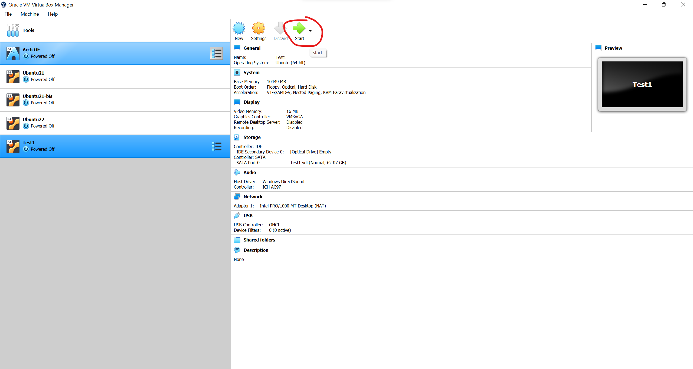
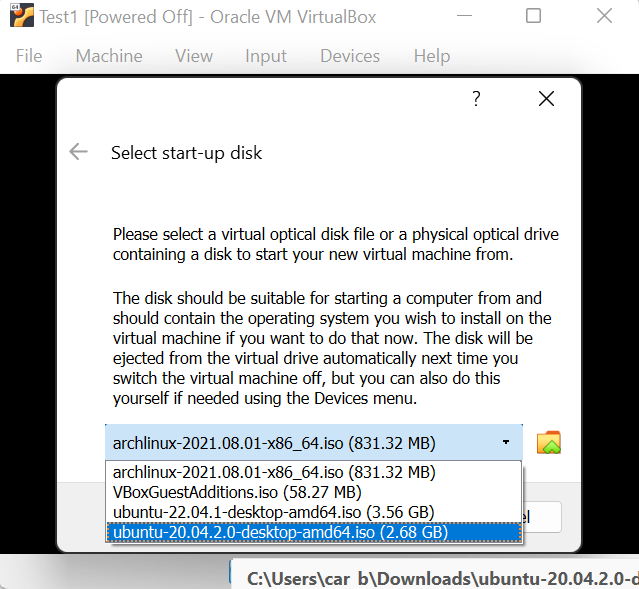
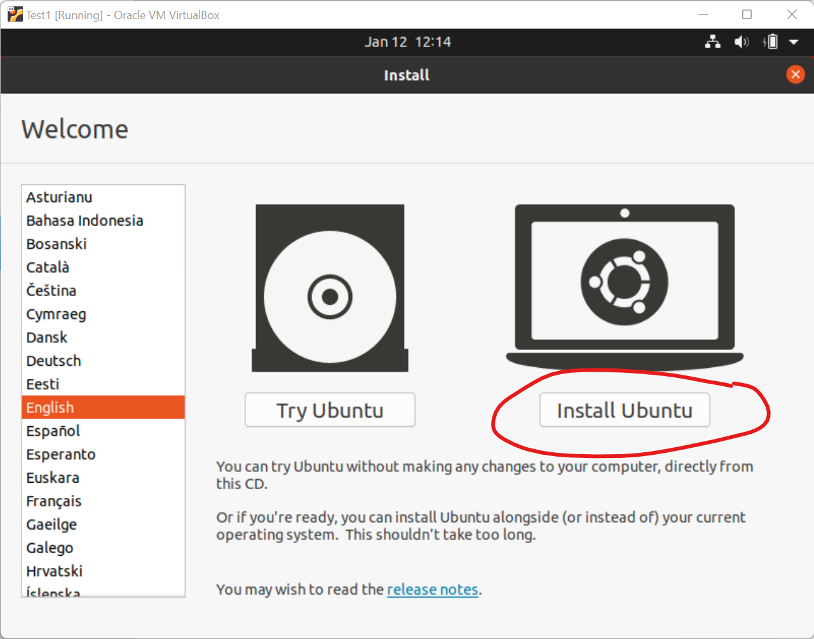

# The setup of the virtual machine
The setup of the virtual machine is relatively easy, just follow the following steps

1. Add a new virtual machine


2. Select the name and the type of the machine you wish to create


3. Select the memory you wish to allocate to the machine


4. Create virtual disk


5. Select disk type


6. Dynamically allocate memory


7. File location and size


8. Virtual machine is created


9. Start machine



10. Select Ubuntu starter



11. Install Ubuntu



And press continue while checking the information is correct. Ubuntu should start its installation once you have chosen a password.

Once the virtual machine installed, it is time to add the guest additions, add a bi-directional clipboard and a shared folder, to be able to transfer information from and to the virtual machine. 
To do so, we will first update our machine and install git to be able to use the scripts that are in this repository.

```
sudo apt update
sudo apt install git
```
And finally clone this repository in the Documents folder

```
cd ~/Documents
git clone https://github.com/carboleda01/fe40-install.git
```

Copy the step 1 of the guest addition script from the git to the Documents folder, give yourself excusion rights and execute the script

```
cd ~/Documents/fe40-install
cp guest_additions_shared_folder_step1.sh ..
cd ..
chmod  u+x guest_additions_shared_folder_step1.sh
./guest_additions_shared_folder_step1.sh
```
This should be enough for you to be able to enable the bi-direction clipboard, once you try to restart the machine.
also, you can select a shared folder before the reboot of the machines


```
cd ~/Documents/fe40-install
cp guest_additions_shared_folder_step2.sh ..
cd ..
chmod  u+x guest_additions_shared_folder_step2.sh
./guest_additions_shared_folder_step2.sh
```
