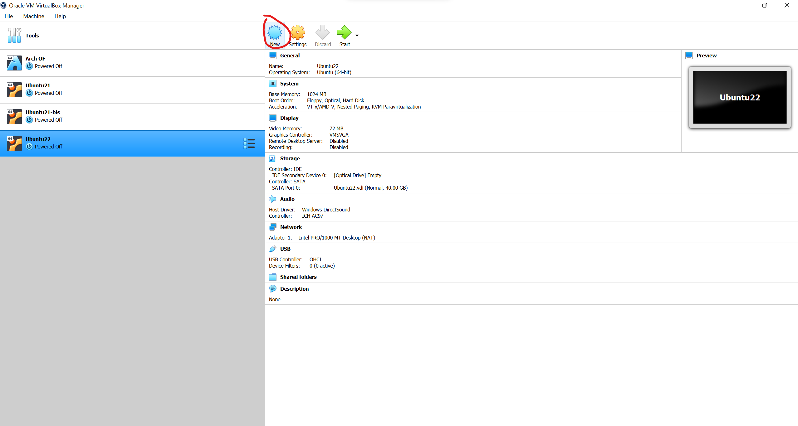
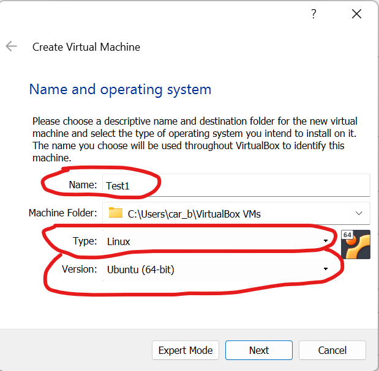
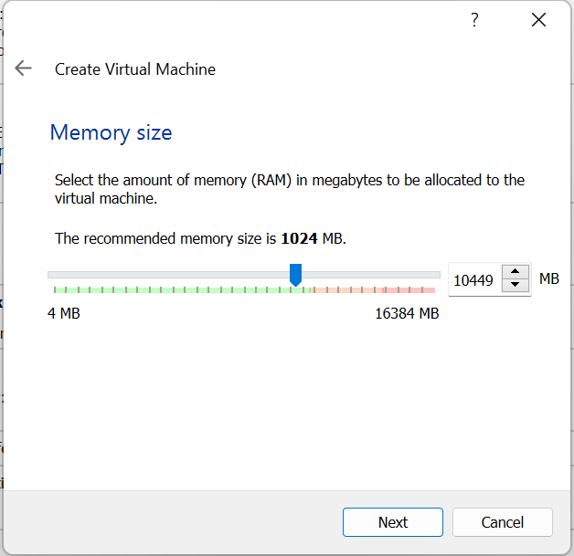
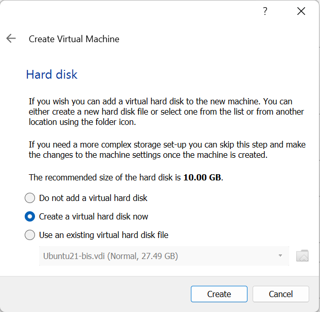
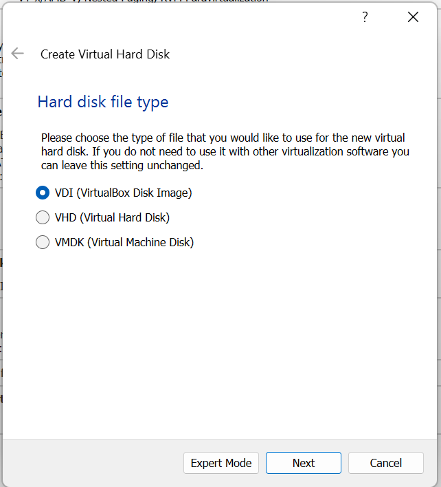
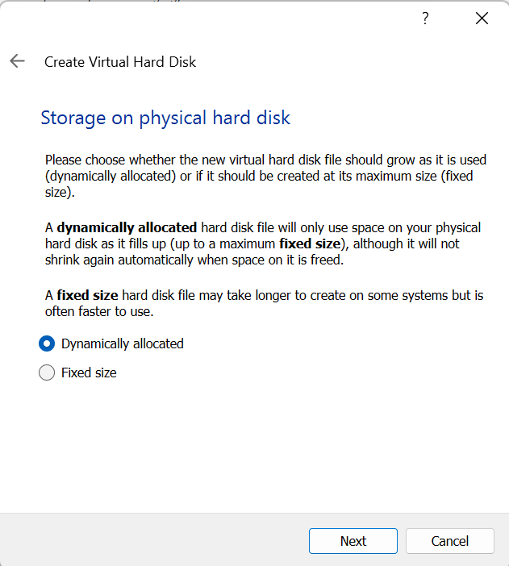
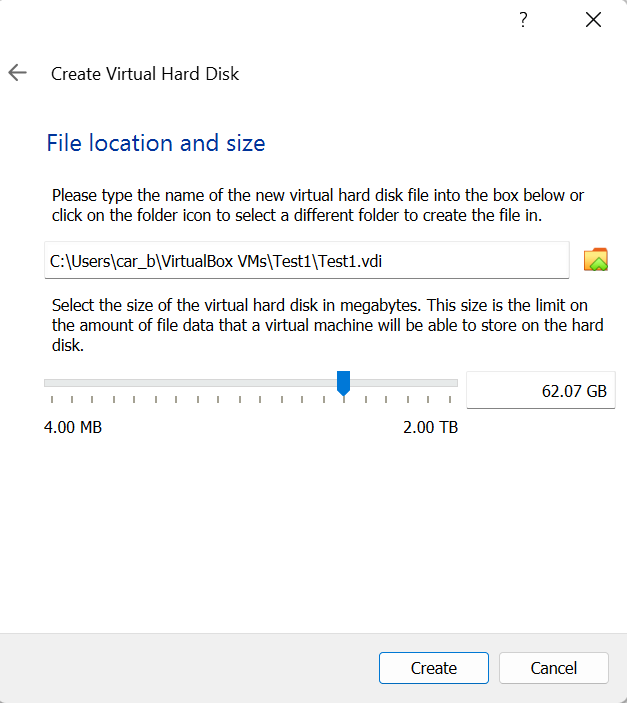

# The setup of the virtual machine
The setup of the virtual machine is relatively easy, just follow the following steps

1. Add a new virtual machine

2. Select the name and the type of the machine you wish to create

3. Select the memory you wish to allocate to the machine

4. Create virtual disk

5. Select disk type

6. Dynamically allocate memory

7. File location and size

8. Virtual machine is created

